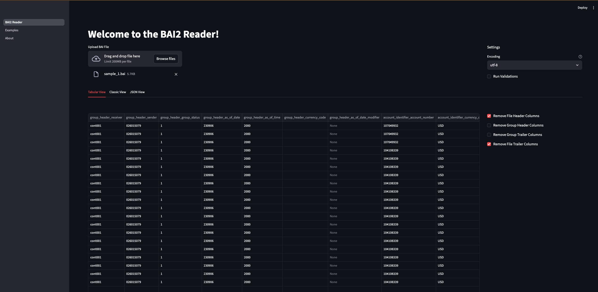

# BAI2 Reader

The BAI2 file format is a standardized, comma-delimited plain text (.txt) format developed by the Bank Administration Institute for electronic cash management, balance reporting, and bank reconciliation. It uses specific record types (01-99) to detail file headers, group headers, account summaries, and transaction details, often including multiple bank accounts in one file. 

## Introduction to BAI
- Comma-separated, with a slash (/) to denote the end of a record line.
- Common Record Codes:
  - 01: File Header
  - 02: Group Header
  - 03: Account Identifier
  - 16: Transaction Detail
  - 49: Account Trailer
  - 98/99: Group/File Trailers
  - 88: Continuation 

Sample nested structure for a BAI2 file. 
- File can have multiple section of
  - Groups :  meaning multiple sections of 02 -> 98
  - Accounts with in each group : meaning multiple sections of 03 -> 49
  - Transactions with in each Account : meaning multiple sections of 16 followed by 88
- 88 is a continuation record that applies only to 03 Accounts and 16 Transactions, and we can have multiple 88 meaning multiple lines of summary
- Some banks don't send 49, 98 Trailer records so they are treated optional

```text
├──  01 File Header
│    ├──  02 GROUP header
│    │    ├──  03 Account Identifier 1
│    │    │    ├──  88 Account Summary/ continuation record
│    │    │    ├──  88 Account Summary/ continuation record
│    │    │    ├──  16 Transaction 1
│    │    │    │    ├──  88 Transaction Summary/ continuation record
│    │    │    │    ├──  88 Transaction Summary/ continuation record
│    │    │    │    ├──  88 Transaction Summary/ continuation record
│    │    │    ├──  16 Transaction 2
│    │    │    │    ├──  88 Transaction Summary/ continuation record
│    │    │    │    ├──  88 Transaction Summary/ continuation record
│    │    │    │    ├──  88 Transaction Summary/ continuation record
│    │    ├──  49 Account Trailer
│    │    ├──  03 Account Identifier 2
│    │    │    ├──  16 Transaction 1
│    │    │    │    ├──  88 Transaction Summary/ continuation record
│    │    │    │    ├──  88 Transaction Summary/ continuation record
│    │    │    │    ├──  88 Transaction Summary/ continuation record
│    │    ├──  49 Account Trailer
│    ├──  98 GROUP Trailer
│    ├──  02 GROUP header 2
│    │    ├──  03 Account Identifier 1 
│    │    │    ├──  88 Account Summary/ continuation record
│    │    │    ├──  16 Transaction 1
│    │    │    │    ├──  88 Transaction Summary/ continuation record
│    │    │    │    ├──  88 Transaction Summary/ continuation record
│    │    │    │    ├──  88 Transaction Summary/ continuation record
│    │    ├──  49 Account Trailer
│    │    ├──  03 Account Identifier 2
│    │    │    ├──  16 Transaction 1
│    │    │    │    ├──  88 Transaction Summary/ continuation record
│    │    │    │    ├──  88 Transaction Summary/ continuation record
│    │    │    │    ├──  88 Transaction Summary/ continuation record
│    │    ├──  49 Account Trailer
│    ├──  98 GROUP Trailer
├──  99 File Trailer
```

## Usage


#### Installation
```shell
pip install bai2-reader
pip install 'bai2-reader[all]'    -- to install all features
pip install 'bai2-reader[ui]'     -- install if you want to explore the UI 
pip install 'bai2-reader[cli]'    -- install if you want to run CLI commands to parse and export 
pip install 'bai2-reader[excel]'  -- install only if you want to export to excel 
```
- Poetry based 
```shell
poetry add bai2-reader
poetry add 'bai2-reader[all]'    -- to install all features
poetry add 'bai2-reader[ui]'     -- install if you want to explore the UI 
poetry add 'bai2-reader[cli]'    -- install if you want to run CLI commands to parse and export 
poetry add 'bai2-reader[excel]'  -- install only if you want to export to excel 
```

```shell
# to export BAI to formats like CSV/JSON/Parquet
bai2 --help

# to export BAI file using UI run below. this will open the UI automatically
bai2-ui
```

### Python Based

```python
# import the package
from bai2_reader import BAI2Reader

# create a reader object
reader = BAI2Reader(run_validation=False, encoding='utf_8')

# read and write using the reader object
reader.read_file('app/bai2_reader/samples/sample_1.bai')\
.write_data(output_file_name='sample_1.csv', output_format='json')
```

- If you have multiple files to be parsed then loop them

```python
import glob
from bai2_reader import BAI2Reader
from bai2_reader.src.enums import OutputFormat

# create a reader object once, and reused it for all files. 
# remember : the default values that you have passed to the below BAI2Reader 
# applies to all files that are read using its object `reader`
reader = BAI2Reader(
  run_validation=False,
  encoding='utf_8',
  output_format=OutputFormat.PARQUET
)

for file in glob.glob('app/bai2_reader/samples/*.bai'):
  # read and write using the reader object
  reader.read_file(file).write_data()
```

- If you just want to read and access the elements

```python
# import the package
from bai2_reader import BAI2Reader

# create a reader object
reader = BAI2Reader(run_validation=False, encoding='utf_8')

# Only read and get bai_data for other activities. 
# bai_data is of type Pydantic model
bai_data = reader.read_file('app/bai2_reader/samples/sample_1.bai').bai_data
```

### CLI

- To get help run: `bai2 export --help`

```text
% bai2 export --help
                                                                                                                                                                                                                                                                                                                        
 Usage: bai2 export [OPTIONS]                                                                                                                                                                                                                                                                                           
                                                                                                                                                                                                                                                                                                                        
 Export BAI2 file to structured formats                                                                                                                                                                                                                                                                                 
                                                                                                                                                                                                                                                                                                                        
╭─ Options ────────────────────────────────────────────────────────────────────────────────────────────────────────────────────────────────────────────────────────────────────────────────────────────────────────────────────────────────────────────────────────────────────────────────────────────────────────────╮
│ *  --input-files                                 TEXT                      Input BAI2 file, if you have multiple files pass them as comma separated. [required]                                                                                                                                                      │
│    --run-validation       --no-run-validation                              Run Validations to perform the counts checks in trailers [default: run-validation]                                                                                                                                                        │
│    --output-dir                                  TEXT                      Output path where the output files have to be stored [default: output]                                                                                                                                                                    │
│    --output-file-names                           TEXT                      Custom output file name if you want, use comma separated if you are passing multiple input files                                                                                                                                          │
│                                                                            Default : '{input_filesNAME_WITHOUT_EXTENSION}_{DATETIME_IN_UTC}.{OUTPUT_FORMAT}'                                                                                                                                                         │
│    --output-format                               [csv|json|excel|parquet]  Output forma [default: csv]                                                                                                                                                                                                               │
│    --encoding                                    TEXT                      Input BAI2 file [default: utf-8]                                                                                                                                                                                                          │
│    --write-args                                  TEXT                      Write args that will be passed to pandas to_csv/to_json/to_parquet functions                                                                                                                                                              │
│                                                                            Example : '{"sep": ",", "compression": "gzip"}'                                                                                                                                                                                           │
│                                                                            Note    : Make sure you wrap the strings in double quotes. :)                                                                                                                                                                             │
│    --help                                                                  Show this message and exit.                                                                                                                                                                                                               │
╰──────────────────────────────────────────────────────────────────────────────────────────────────────────────────────────────────────────────────────────────────────────────────────────────────────────────────────────────────────────────────────────────────────────────────────────────────────────────────────╯
```

Examples

- Single File export
```shell
bai2 export --input-files app/bai2_reader/samples/sample_1.bai
```
- Multiple files export
```shell
bai2 export \
  --input-files app/bai2_reader/samples/sample_1.bai,app/bai2_reader/samples/sample_2.bai \
  --output-format json \
  --output-file-names output_file_1.json,output_file_2.json \
  --output-dir 'output_path_here' 
```
- Export with custom write arguments
```shell
bai2 export \
  --input-files app/bai2_reader/samples/sample_1.bai \
  --output-format json \
  --write-args '{"index": false, "orient": "records", "indent": 4}'
```


### UI for Analysis

UI is created using [Streamlit](https://streamlit.io/) app. The UI runs in your local machine and allows you to explore the BAI files. 

```shell
# need to install UI dependencies
pip install 'bai2-reader[ui]' 

# Start the UI
bai2-ui
```

You get to see 3 different views in the UI

1. Tabular View
2. Classic View
3. JSON View

#### Tabular View

Flattens the BAI files to a tabular format. Table allows you to filter and search transactions. 



#### Classic View

Allows you to expand and collapse each section of BAI file. 


#### JSON View

Allows you to see the BAI data in JSON format. 


> Note : You can only explore one file at a time.
